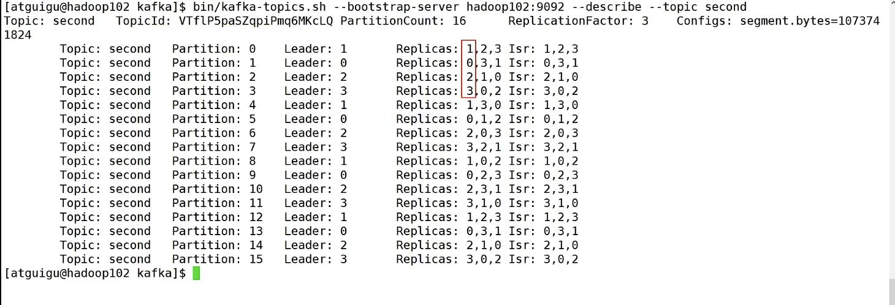
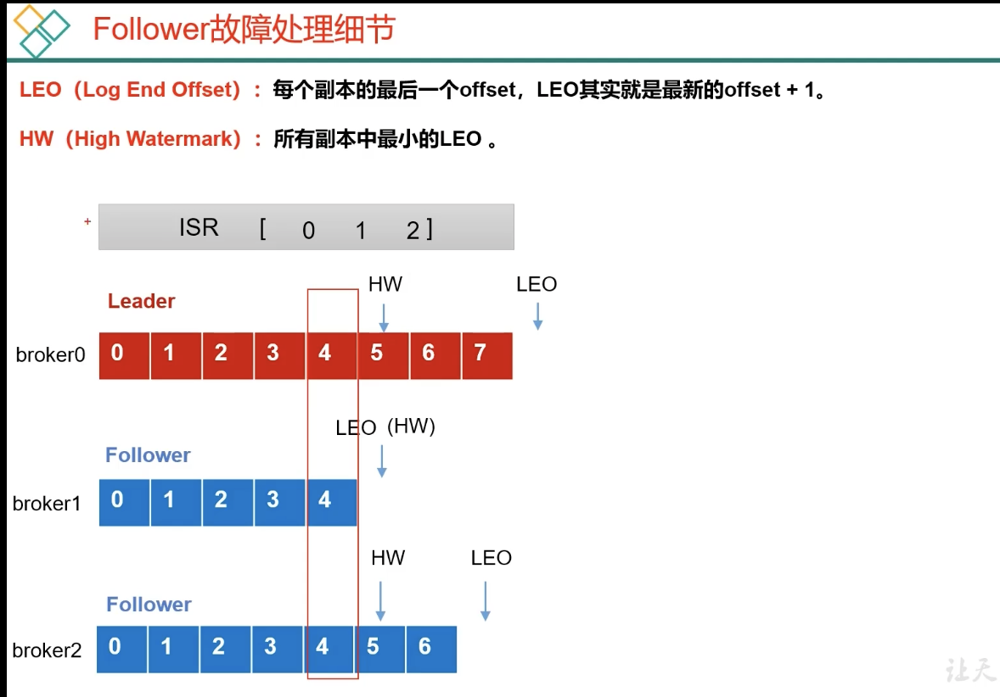
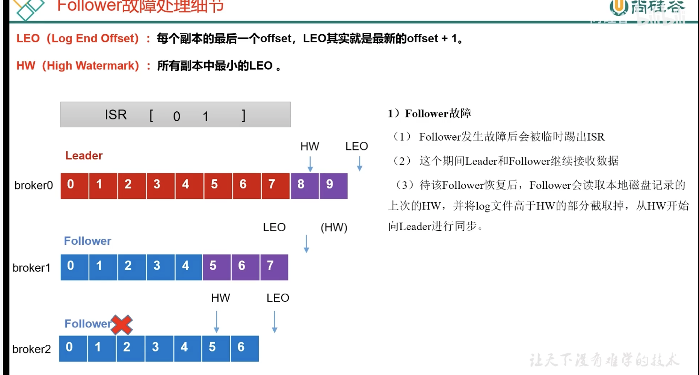
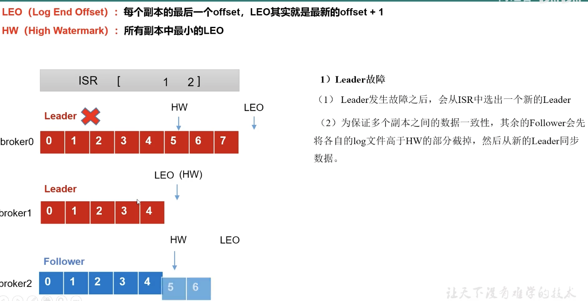
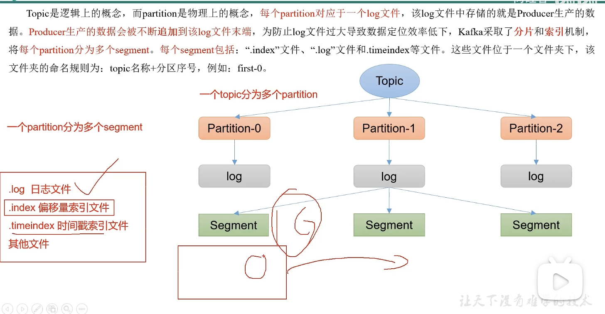
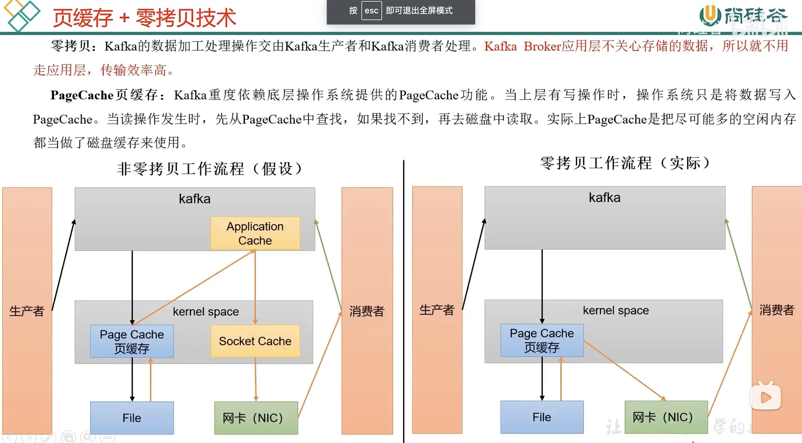
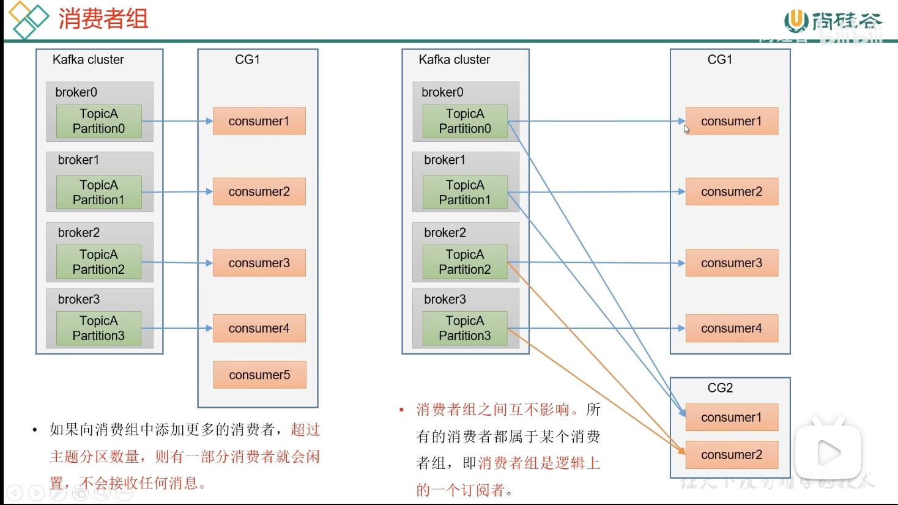
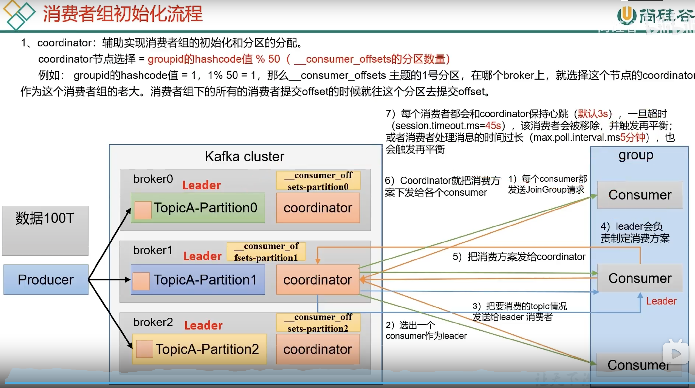
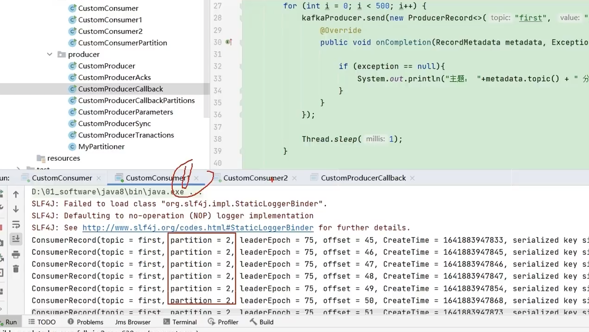

# www

Properties和Map都是以键值对的形式存储的，但是他们有什么区别吗？？
最大的区别就是 Properties可以直接导入IO流 读取IO流中的数据 并且能把自己的元素输出到IO流中。就是我们可以去写properties文件，进行读写。

## Kafka

kafka [] 命令后对topic增删改查 --config 引用配置文件

--list --create --describe 详情

分区内类似Hadoop，分块分割存储。分区从0开始，Leader为2  r
Replicas副本2 0 1。设计3个副本，分布于三台主机，

生产者消费者对Leader进行读写操作

分区数只能增加不能减少。不能通过命令行对方式增减副本。

开启消费服务之后，会增量的消费数据，加上from beginning 消费历史数据

Produce->Interceptors拦截器->Serializer序列化器->Pationer分区器，决定发送到哪个分区 以上过程在内存中完成默认32M。

只有数据累积到batch.size之后，sender才会发送数据，默认16k

linger.ms 数据如果迟迟未达到batch.size，sender等待linger.ms设置的时间

Request队列，由Kafka集群拉取到指定topic到指定分区，

拉取到时候，参考tcp的发送接收的缓冲区机制，允许5个或者若干个接收缓存，可以乱序，但接收缓存区必须接收完再进行下一批，否则重试等应答，发送的过程中进行集群的同步，消费一批，生产者删除一批。

Selector就是异步IO的方式，

同步、异步（情况较多）发送API，

回调函数，发送到队列，再返回发送结果。异步方法之后加上一个get()就行

表名字作为key，发到同一个表里面。

黏性分区，同一批数据尽量分在同一个分区，

### ISR

 Leader收到数据，所有Follower都开始同步数据，但有一个Follower，因为某种故障，迟迟不能与Leader进行同步，那这个问题怎么解决呢

 Leader维护了一个动态的in-sync replica set(ISR),意为和Lead保持同步的Follower+Leader集合（leader： 0， isr： 0，1，2

 如果Follower长时间未向Leader发送通信请求或同步数据，则该Follower将被**踢出ISR**，该时间阈值由
 replica.lag.time.max.ms参数设定，默认30s。例如2超时，(leader:0, isr 0,1
)

这样就不用等长期联系不上或者已经故障等节点，以后就不接收他的消息了

数据完全可靠条件=ACK级别设置为-1 + 分区副本大于等于2 + ISR里应答的最小副本数量大于等于2

ACK=0，生产者发送过来的数据就不管了，可靠性差，效率高

ACK=1，生产者发送过来数据 Leader应答，可靠性中等，效率中等。

ACK=-1 可靠性最高，生产者发送过来数据Leader和ISR队列里面所有Follower应答，可靠性高，效率低

生产环境中，acks=0很少使用，acks=1，一般用于传输普通日志，允许丢个别数据

acks=-1，一般用于传输比较要紧的数据，不允许出错。

至少一次，ACK级别为-1 + 分区副本大于等于2 + ISR里应答的最小副本数量大于等于2

最多一次，ACK级别设置为0
z
总结：

    ACK=-1可以保证数据不丢失，但不能保证数据不重复

    ACK=0可以保证数据不重复，但是不能保证数据不丢失

生产环境中需要精确一次，对于一些重要的信息，

幂等性，就是指Producer不论向Broker发送多少次重复数据，Broker端都只会持久化一次，保证了不重复

精确一次=幂等性 + ACK = -1

重复数据的判断标准，具有<PID,Partition,SeqNumber>相同主键的消息提交时，Broker只会持久化一次。其中PID时Kafka每次重启都会分配一个新的：partition表示分区号

Sequence Number是单调递增的

所以幂等性只能保证的是在单分区单会话内不重复

### 事务

事务协调器，默认有50个分区，每个分区负责一部分事务，事务分区是根据事务Id的hashcode值%50,

计算该事务处于哪个分区，该分区Leader副本所在的broken节点即为这个事务id对应的事务控制器节点

一个broken缓存接收五个request，如果五个request都符合要求（序号正确）则可以落盘，否则要重试

### zookeeper

可以查看broker信息，每台broker启动后，都会在zookeeper中注册

ids brokerid列表

主节点选举规则，以isr中存活为前提，按照AR中排在前面的优先，ar[1,0,2], isr[1,0,2], 那么leader就会按照1，0，2的顺序轮询

创建一个负载均衡的topic

vim topics-to-move.json

{
    "topics": [
        {"topic": "first"}, {"topic": "second"}
    ]
}

节点退役，生成一个退役计划，写入increase- replication-factor.json

### 架构

1. 生产者

   100T数据
2. broker

   1. broker 服务器 Hadoop102 103 104
   2. topic 主题 对数据的分类
   3. 分区
   4. 可靠性   副本
   5. leader follower
   6. 生产者和消费者 只针对leader操作
3. 消费者

   1. 消费者和消费者相互独立
   2. 消费者组（某个分区，只能由一个消费者消费）
4. zookeeper

   1. broker.ids 0 1 2
   2. leader

## 入门

1. 安装

   1. broker.id 必须全局唯一
   2. broker.id log.dirs zk.kafka
   3. 启动停止 先停止Kafka，再停zookeeper
   4. 脚本
      #!/bin/bash
2. 常用命令行

   1. 主题Kafka0 topic.sh
   2. 生产者 Kafka-console-producer.sh
   3. 消费者 kafka-console-consumer.sh

3.过程
    1. Kafka Producer
    2.  send
    3.  拦截器
    4.  序列化thrim
    5.  分区器，32M发送缓存，sender线程发送，
        1. 批次到或者时间到就可以发送
        2. NIO selector 打通，网络IO到指定集群的broker，分区副本之间同步

3. 生产者

   1. 原理
   2. 异步发送API
      1. 配置
         1. 连接 bootstrap- server
         2. key value序列化
      2. 创建生产者 KafkaProducer<String, String>()
      3. 发送数据 send() send( , new Callback)
      4. 关闭资源
   3. 同步发送 send() send( ,new Callback).get()
   4. 分区
      1. 分区的好处
         1. 存储
         2. 计算
      2. 默认分区规则
         1. 指定分区，按分区走
         2. key key的hashcode值%分区数
         3. 没有指定key 没有指定分区 黏性
      3. 自定义分区 定义类 实现partition接口
   5. 吞吐量提高
      1. 批次大小 16k 32k
      2. linger.ms 0=》5-100ms
      3. 压缩
      4. 缓存区大小 32m =》 64m
   6. 可靠性
      1. acks=0 会丢失数据 效率最高
      2. acks=1 也可能会丢，leader有应答机制 传输普通日志
      3. acks=-1 完全可靠 + 副本数量大于等于2 + isr大于等于2 =》不会丢失，会有数据重复
   7. 数据重复问题
      1. 幂等性
         1. <pid, 分区号， 序列号> 保证单机单连接 序列号单调递增
         2. 事务
            1. 底层基于幂等性
            2. 事务协调性 默认用50个分区，分布在各个节点？
            3. 事务id，对50取模，找到分区，所在的broker，的事务协调器，就是本次事务的负责人
            4. 生产者会跟事务协调器申请一个pid，给到之后向leader发送数据
            5. 发送数据之后，发送commit申请，然后根据持久化的结果返回给生产者，生产者再删除数据
            6. 五个API
               1. 初始化
               2. 启动
               3. 消费者offset
               4. 提交
               5. 终止
   8. 数据有序
      1. 单分区内有序
      2. 多分区有序
   9. 乱序
      1. inflight 设置为1
      2. 没有幂等性
      3. 有幂等性 对数个请求进行缓存，
4. broker

   1. zookeeper存储了哪些信息

      1. broker.ids
      2. leader
      3. 辅助选举 controller
   2. 工作流程

      1. 每个节点都有controller，参与主节点的竞争
      2. 选择AR节点内的，并且活着的排在前面的作为leader
      3. 生产者发送数据给集群的主节点进行读写，leader收到数据之后，follower会主动跟他同步，拉取数据，持久到磁盘。位置在logdir,topic不同的分区的log目录，
      4. log存储消息文件、index、timeIndex。分区也会创建索引，方便查询
      5. 消息索引

      bin/kafka-run-class.sh kafka.tools.DumpLogSegments --files 00000000000000000000.index

      最后一行
      offset:5083  position:1072592768

      6. Kafka如何查找指定offset的Message的
         1. 二分查找索引
   3. 服役和退役

      1. 准备一台新服务器 Hadoop
      2. 对哪个topic主题操作
      3. 形成计划
      4. 执行计划
      5. 验证计划
   4. 退役

      1. 要退役的节点不让存储数据
      2. 退出节点
5. Kafka副本

   1. 默认副本1个，生产环境一般默认两个，保证数据可靠性。太多副本增加磁盘存储空间，增加网络上数据传输，降低效率
   2. Kafka中副本分为：Leader和Follower。Kafka生产者只会把数据发往leader，然后Follower找leader进行同步数据
   3. Kafka分区中的所有副本统称为AR（Assigned Replicas） AR=ISR+OSR
      1. ISR： 表示和Leader保持同步的Follower集合（即经常保持活跃的可靠的Follower）。如果Follower长时间未向Leader发送通信请求或同步数据，则该Follower将被踢出ISR。该时间阈值由replica.lag.time.max.ms参数设定，默认30s，Leader发生故障后，就会从ISR选举新的leader。
      2. 
6. leader选举流程

   1. 在isr中存活为前提，按照AR中排在前面的优先
7. Follower故障处理细节

   1. LEO（long End Offset）每个副本的最后一个offset，LEO其实就是最新的offset+1
   2. HW （High Watermark） 所有副本中最小的 LEO
      
   3. Follower故障之后，会被临时踢出ISR。这个期间Leader和Follower继续接收数据
   4. 待该Follower恢复后，Follower会读取本地磁盘记录的上次的HW，并将log文件高于HW的部分截取掉，从HW开始向Leader进行同步
      
   5. 等待Follower的LEO大于等于该 partition的HW，即Follower追上Leader之后，就可以重新加入ISR了。
8. Leader故障处理细节

   1. Leader发生故障之后，会从ISR中选出一个新的Leader
      
   2. 为保证多个副本之间的数据一致性，其余的follower会先将各自的log文件高于HW的部分截掉，然后从新的Leader同步数据
   3. 注意，只能保证副本之间的数据一致性，不能保证数据不丢失或者不重复
      
   4. 新建一个topic，16个分区，3个副本，1主2从
   5. 生产经验，调整分区分布。Kafka默认各个服务器条件一致，实际可以根据服务器的配置与使用情况
   6. 正常情况下，Kafka本身会自动把Leader partition均匀分布在各个机器上，来保证每台机器的读写吞吐量都是均匀的。但是如果某些broker宕机，会导致leader partition过于集中在其他少部分几台broker上，这会导致少数几台broker的读写压力过高，其他的broker重启之后都是follower partition，读写请求很低，造成集群负载不均衡
   7. 可以设置auto.leader.rebalance.enable，默认上true，自动Leader partition平衡
      1. 平衡比例默认是10%，每个broker允许的不平衡的leader的比例。如果每个broker超过了这个值，控制器会处罚leader的平衡
      2. leader.imbalance.check,interval,seconds默认值是300s，检查leader负载是否均衡的间隔时间。
9. 文件存储

   1. Topic是逻辑上的概念，而partition是物理上的概念，每个partition对应一个log文件，该log文件存储的就是Produce生产的数据。
   2. produce生产的数据会不断追加到该log文件的末端，为防止log文件过大导致数据定位效率低，Kafka采取了分片和索引机制，将每个partition分为多个segment。
   3. 每个segment又包括：“index文件、log文件和timeindex等文件。这些文件位于一个文件夹下，该文件夹的命名规则为：topic名称+分区序号，例如first-0
      
   4. log的组成，bashoffset lastoffset count baseSequence lastSequence, producerId

   在log中定位，根据文件名用二分查找
10. 文件清理策略

    1. Kafka默认的日志保存时间为7天，可以通过调整如下参与修改保存时间
    2. 清除策略又有delete和compact两种
       1. delect删除 设置有效期
       2. compact 日志压缩，对于相同的key的不同value值，且只保留最后一个版本

## 页缓存 零拷贝

1. 零拷贝：Kafka的数据加工处理操作交由Kafka生产者和Kafka消费者处理。Kafka Broker应用层不关心存储的数据？ 所以不用走应用层，传输效率高
   1. 假设不用非零拷贝工作流程

## kafka的消息方式

1. pull拉模式
   consumer采用从broker中主动拉取数据
   Kafka采用这种方式
2. push推模式
   Kafka没有采用这种方式，因为由broker决定消息发送效率，很难适应所有消费者的速率。如果推送的速度过快，消费者将会来不及消费数据
3. pull模式不足之处是，如果Kafka没有数据，消费者 kennel会陷入循环中，一直返回数据
4. 一个消费者组消费一个分区。消费到哪了，offset存储在消费者主机内，方便管理，减少与zookeeper之间的通信
5. 消费者组原理
   1. 组成条件
      1. 所有消费者都有一个消费者组ID
      2. 消费者组内每个消费者负责消费不同分区的数据，一个分区只能由一个组内消费者消费
      3. 消费者组之间互不影响。所有的消费者都属于某个消费者组，即消费者组是逻辑上一个订阅者
         
      4. 
   2. 消费者组初始化流程
      1. 
      2. 一个消费者消费一个分区
         
6. 生产经验-分区的分配以及再平衡
   1. 一个consumer group有多个consumer组成，一个topic由多个partition组成，现在问题是，到底由哪个consumer来消费哪个partition数据
   2. Kafka分配过程
      1. 每个consumer都发送joinGroup请求
      2. 选出一个consumer作为leader
      3. 把药消费的topic情况发送leader消费者
      4. leader会负责定消费方案
      5. 把消费方案发给coordinator
      6. coordinator就把消费方案下发给各个consumer
      7. 每个消费者都会和coordinator保持心跳(默认3s),一旦超过session.timeout.ms=45s,该消费者会被移除，并触发再平衡，或者消费者处理消息的时间过长(max.poll.interval.ms5分钟),也会触发再平衡
7. 有四种主流的分区分配策略
   1. range是对每个topic而言，对消费者序号进行排序，平均分配。如果对于除不尽的情况，8/3，即会造成资源倾斜，topic多的时候会造成某些节点压力过大。
   2. roundRobin轮询分区策略，**是把所有的partition和所有的consumer**都列出来，然后按照hashcode进行排序，最后通过轮询算法来分配partition给到各个消费者。弥补了range算法的多个topic造成某些节点压力过大的问题。
   3. sticky以及再平衡。尽量均匀分配，再某个节点破坏了之后，会保证原有消费者的指定的分区不改变，破坏节点的分区均匀的分配到其余节点上。
8. 自动提交
   1. 默认开启自动提交，5s提交一次。生产者发送消息，消费者不间断地拉取，而offset由Kafka每5s自动提交到consumer_offset中，可设置提交时间间隔。
   2. 虽然自动提交比较简单便利，但不够灵活，开发人员很难把握offset提交的时机。手动提交分为两种，分别是
      1. commitSync同步提交
         1. 同步提交必须等待offset提交完毕之后，再去消费下一批数据
      2. commitAsync异步提交
         1. 发送完提交offset之后，就可以消费下一批数据了，不需要等待提交完毕的结果
         2. **生产环境中通常异步提交的比较多**
