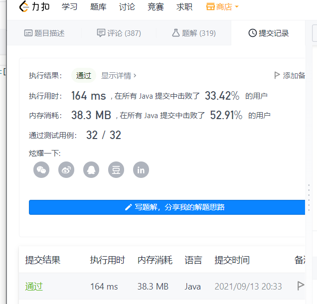

hmget

```
redis 127.0.0.1:6379> HSET myhash field1 "foo"
(integer) 1
redis 127.0.0.1:6379> HSET myhash field2 "bar"
(integer) 1
redis 127.0.0.1:6379> HMGET myhash field1 field2 nofield
1) "foo"
2) "bar"
3) (nil)
```

